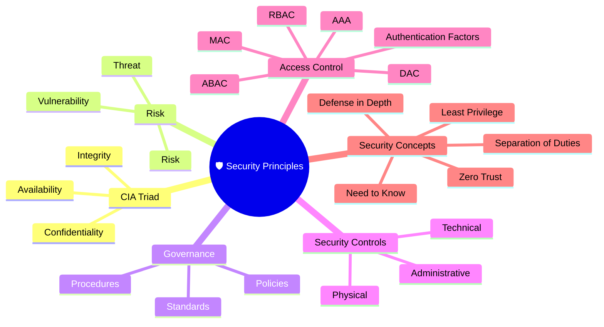
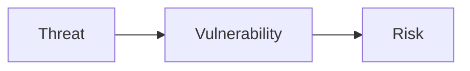
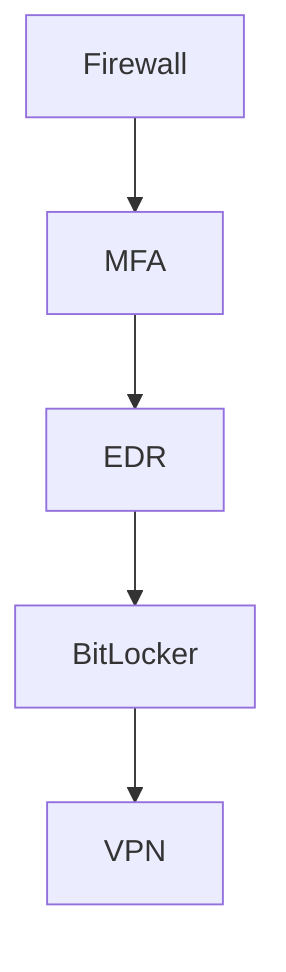

# 🛡️ Domain 1 – Security Principles

> **Objective:** Understand the core principles of information security, risk management, governance, and access control that form the foundation of cybersecurity.

---

# 🧠 Domain Mind Map



---

# 📌 Domain Overview

Security Principles form the foundation of cybersecurity. Every security decision—from user authentication to enterprise architecture—is built upon these concepts.

---

# 🔺 CIA Triad

The CIA Triad defines the three primary security objectives.

| Principle | Purpose | Examples |
|-----------|---------|----------|
| 🔒 Confidentiality | Prevent unauthorized access | Encryption, MFA, ACLs |
| ✅ Integrity | Prevent unauthorized modification | Hashing, Digital Signatures |
| ⚡ Availability | Ensure systems remain accessible | Backups, RAID, Load Balancers |

> 💡 **Exam Tip:**  
> Encryption protects **Confidentiality**, Hashing protects **Integrity**, and Backups support **Availability**.

---

# ⚠ Threat, Vulnerability & Risk



### Definitions

| Term | Meaning |
|------|---------|
| Threat | Anything capable of causing harm |
| Vulnerability | A weakness that can be exploited |
| Risk | Likelihood of a threat exploiting a vulnerability |

### Example

```
Threat
↓
Attacker

Vulnerability
↓
Unpatched VPN

Risk
↓
Unauthorized Access
```

---

# 🏢 Security Governance

Governance defines **how security is managed** across an organization.

It includes:

- Policies
- Standards
- Procedures
- Roles & Responsibilities
- Compliance

> 💡 Governance defines the direction. Security teams implement it.

---

# 🛡 Security Controls

| Administrative | Technical | Physical |
|---------------|-----------|----------|
| Policies | Firewalls | CCTV |
| Awareness Training | MFA | Guards |
| Background Checks | EDR | Biometric Access |

---

# ⚖ Due Care vs Due Diligence

| Due Care (DO) | Due Diligence (CHECK) |
|---------------|-----------------------|
| Install | Audit |
| Configure | Review |
| Encrypt | Assess |
| Patch | Verify |
| Train | Monitor |

---

# 🏷 Data Classification

| Classification | Example |
|----------------|---------|
| Public | Company Website |
| Internal | Employee Handbook |
| Confidential | Customer Data |
| Restricted | Payroll / Encryption Keys |

---

# 🔑 Least Privilege vs Need to Know

| Principle | Purpose |
|------------|----------|
| Least Privilege | Minimum permissions required |
| Need to Know | Access only required information |

---

# 👥 Separation of Duties

```text
Employee A
Creates Payment

↓

Employee B
Approves

↓

Employee C
Releases
```

Purpose:

- Reduce fraud
- Reduce mistakes

---

# 🛡 Defense in Depth



No single control should be trusted completely.

---

# 🌐 Zero Trust

Core Principle:

> **Never Trust. Always Verify.**

Signals evaluated may include:

- Identity
- MFA
- Device Compliance
- Location
- Sign-in Risk
- IP Reputation

---

# 🔐 Authentication, Authorization & Accounting (AAA)

| Component | Question Answered |
|-----------|-------------------|
| Authentication | Who are you? |
| Authorization | What are you allowed to do? |
| Accounting | What did you do? |

---

# 🔑 Authentication Factors

| Factor | Example |
|---------|---------|
| Know | Password, PIN |
| Have | Smart Card, Phone |
| Are | Fingerprint, Face ID |

> Password + Fingerprint = **MFA**

---

# 📂 Access Control Models

| Model | Controlled By | Example |
|--------|---------------|---------|
| DAC | Owner | Google Drive Sharing |
| MAC | System Labels | Military |
| RBAC | Job Role | Security Analyst |
| ABAC | Multiple Attributes | Entra Conditional Access |

---

# 🌍 Real-World Scenario

An employee signs into Microsoft Entra.

The system evaluates:

- Username
- Password
- MFA
- Device Compliance
- Location
- Sign-in Risk

Only if the policy requirements are met is access granted.

This demonstrates **Zero Trust** and **ABAC** working together.

---

# ⚠ Common Exam Mistakes

- Threat ≠ Risk
- Vulnerability ≠ Threat
- Least Privilege ≠ Need to Know
- Due Care ≠ Due Diligence
- RBAC ≠ ABAC

---

# 💡 Exam Tips

> ✅ Encryption → Confidentiality

> ✅ Hashing → Integrity

> ✅ Backups → Availability

> ✅ Password + Fingerprint = MFA

> ✅ Zero Trust = Never Trust, Always Verify

> ✅ Governance defines direction

---

# 📝 Key Takeaways

- CIA is the foundation of information security.
- Threats exploit vulnerabilities to create risk.
- Governance directs security strategy.
- Security controls work together through Defense in Depth.
- Zero Trust continuously verifies every access request.
- Authentication verifies identity, Authorization grants permissions, Accounting records activity.