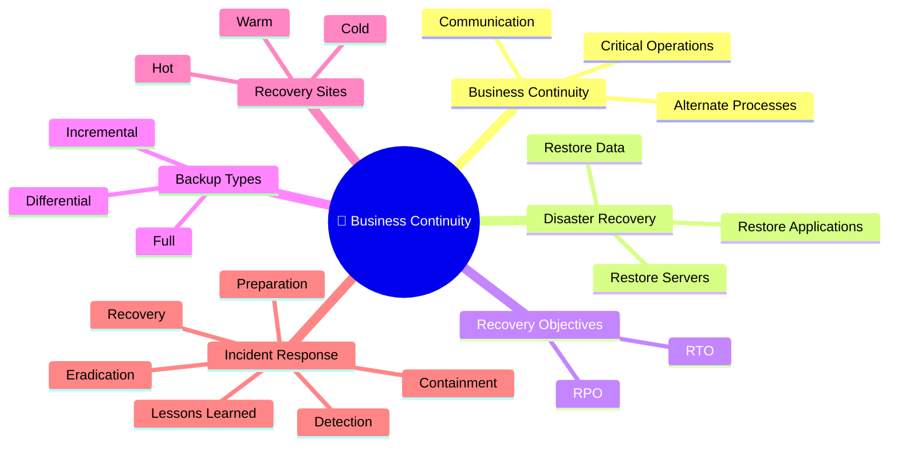

# 🔄 Domain 2 – Business Continuity, Disaster Recovery & Incident Response

> **Objective:** Understand how organizations prepare for, respond to, recover from, and continue operations during disruptive events.

---

# 🧠 Domain Mind Map



---

# 📌 Domain Overview

Business Continuity and Disaster Recovery ensure an organization can survive disruptions while minimizing downtime and data loss. Incident Response provides a structured approach to detecting, containing, and recovering from security incidents.

---

# 🏢 Business Continuity (BC)

Business Continuity focuses on **keeping the business running** during a disruption.

### Examples

- Alternate work locations
- Manual business processes
- Redundant systems
- Alternate communication methods

### Goal

> Keep business operations functioning.

---

# 💻 Disaster Recovery (DR)

Disaster Recovery focuses on **restoring IT systems** after an outage.

### Examples

- Restore servers
- Recover databases
- Restore applications
- Rebuild infrastructure

### Goal

> Restore technology services.

---

# ⚖️ Business Continuity vs Disaster Recovery

| Business Continuity | Disaster Recovery |
|---------------------|-------------------|
| Focuses on business operations | Focuses on IT systems |
| Keeps the business running | Restores technology |
| Business-first | Technology-first |

> 💡 **Exam Tip:**  
> BC = Business  
> DR = Technology

---

# 📊 Business Impact Analysis (BIA)

A Business Impact Analysis identifies:

- Critical business functions
- Financial impact
- Recovery priorities
- Recovery objectives

### Purpose

Determine **what must be restored first** after a disruption.

---

# ⏱ Recovery Objectives

| Objective | Question Answered |
|------------|-------------------|
| **RTO** | How long can the system be unavailable? |
| **RPO** | How much data can be lost? |

### Memory Trick

```text
⏱ RTO = Time

💾 RPO = Data
```

---

# 💾 Backup Types

Backups primarily support **Availability**.

| Backup Type | What Gets Backed Up? | Speed | Storage |
|-------------|----------------------|--------|---------|
| Full | Everything | Slowest | Highest |
| Incremental | Changes since the last backup | Fastest | Lowest |
| Differential | Changes since the last Full backup | Medium | Medium |

---

## 🧠 Memory Trick

### Incremental

```text
Monday     Tuesday     Wednesday     Thursday

Full ───► Inc ───► Inc ───► Inc
```

Each Incremental stores only changes since the previous backup.

---

### Differential

```text
Monday     Tuesday     Wednesday     Thursday

Full ───► Diff ───► Diff ───► Diff
           ↑          ↑          ↑
           └──────────┴──────────┘
```

Every Differential backup contains everything changed since Monday's Full backup.

---

# 🏢 Recovery Sites

| Site | Cost | Recovery Speed |
|------|------|----------------|
| Cold | 💲 | Slowest |
| Warm | 💲💲 | Moderate |
| Hot | 💲💲💲 | Fastest |

---

# 🔁 Redundancy

Redundancy removes **Single Points of Failure (SPOF).**

Examples:

- Dual ISPs
- Multiple Firewalls
- Multiple Domain Controllers
- RAID Storage

Purpose:

Improve **Availability**.

---

# 🚨 Incident Response Lifecycle


---

# 📖 Incident Response Phases

| Phase | Primary Goal |
|--------|--------------|
| Preparation | Be ready before an incident |
| Detection & Analysis | Identify suspicious activity |
| Containment | Stop the spread |
| Eradication | Remove the root cause |
| Recovery | Restore normal operations |
| Lessons Learned | Improve future response |

---

# 🌍 Real-World Scenario

An employee opens a phishing email containing ransomware.

```text
Preparation
↓
Security awareness training

↓

Detection
↓
EDR detects ransomware

↓

Containment
↓
Isolate the infected laptop

↓

Eradication
↓
Remove malware & patch vulnerabilities

↓

Recovery
↓
Restore files from backup

↓

Lessons Learned
↓
Update email filtering & train users
```

---

# ⚠ Common Exam Mistakes

- Business Continuity ≠ Disaster Recovery
- RTO measures **Time**, not data.
- RPO measures **Data Loss**, not downtime.
- Containment stops the spread.
- Eradication removes the cause.
- Recovery restores operations.

---

# 💡 Exam Tips

> ✅ BC = Keep the business running

> ✅ DR = Restore IT systems

> ✅ RTO = Time

> ✅ RPO = Data Loss

> ✅ Hot Site = Fastest & Most Expensive

> ✅ Cold Site = Cheapest & Slowest

> ✅ Backups support Availability

---

# 📝 Key Takeaways

- Business Continuity keeps critical business functions operating during disruptions.
- Disaster Recovery restores IT infrastructure and services.
- BIA determines recovery priorities.
- RTO defines acceptable downtime, while RPO defines acceptable data loss.
- Backup strategies involve trade-offs between speed, storage, and recovery time.
- Recovery sites balance cost against recovery speed.
- Following the Incident Response lifecycle minimizes damage and improves future resilience.