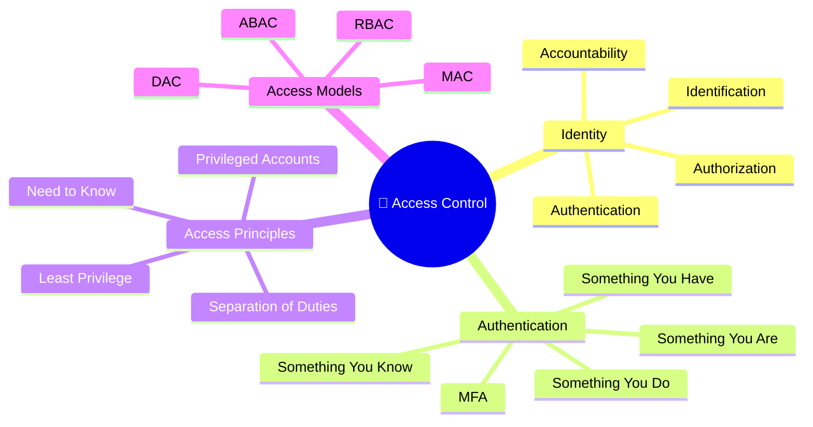
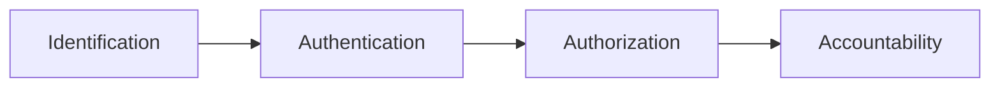

# 🔐 Domain 3 – Access Control Concepts

> **Objective:** Understand how identities are verified, permissions are assigned, and access to organizational resources is controlled securely.

---

# 🧠 Domain Mind Map



---

# 📌 Domain Overview

Access Control ensures that only authorized users can access organizational resources. It covers identity verification, authentication methods, authorization, auditing, and access control models used in modern enterprise environments.

---

# 🔑 Identification, Authentication, Authorization & Accountability (IAAA)



| Concept | Question Answered | Example |
|----------|-------------------|----------|
| **Identification** | Who are you? | Username |
| **Authentication** | Can you prove it? | Password, Fingerprint |
| **Authorization** | What are you allowed to do? | Folder Permissions |
| **Accountability** | What did you do? | Audit Logs, SIEM |

---

# 🆔 Identification

A user **claims** an identity.

Examples:

- Username
- Employee ID
- Email Address

> 💡 Identification does **not** prove identity.

---

# 🔐 Authentication

Authentication **verifies** a claimed identity.

Examples:

- Password
- PIN
- Fingerprint
- Smart Card
- MFA

Enterprise Example:

A user signs into Microsoft 365 using a password and Microsoft Authenticator.

---

# 🔓 Authorization

Authorization determines **what an authenticated user can access.**

Examples:

- Read-only permissions
- Administrator access
- Folder permissions
- Application roles

Enterprise Example:

A Security Analyst can view SIEM dashboards but cannot modify detection rules.

---

# 📜 Accountability

Accountability records user activity.

Examples:

- Audit Logs
- SIEM Events
- Windows Event Logs
- Azure Sign-in Logs

Purpose:

Provide traceability and support investigations.

---

# 🔑 Authentication Factors

| Factor | Examples |
|----------|----------|
| Something You Know | Password, PIN, Passphrase |
| Something You Have | Smart Card, Phone, Hardware Token |
| Something You Are | Fingerprint, Face ID, Iris Scan |
| Something You Do | Typing Pattern, Signature Dynamics |

---

# 🔐 Multi-Factor Authentication (MFA)

MFA requires **two or more different authentication factors.**

✅ Valid

| Factor 1 | Factor 2 |
|-----------|-----------|
| Password | Authenticator App |

❌ Not MFA

| Factor 1 | Factor 2 |
|-----------|-----------|
| Password | Security Question |

Both belong to **Something You Know.**

---

# 👥 Access Control Principles

| Principle | Purpose |
|------------|----------|
| Least Privilege | Minimum permissions required |
| Need to Know | Access only required information |
| Separation of Duties | Divide critical tasks among multiple people |

---

# 🔑 Least Privilege

Users receive only the permissions required to perform their job.

Example:

A Helpdesk Engineer can reset passwords but cannot modify firewall rules.

---

# 📂 Need to Know

Users should access only the information necessary for their responsibilities.

Example:

HR can access employee records but not merger documentation.

---

# ⚖ Separation of Duties

```text
Employee A
Creates Request

↓

Employee B
Approves

↓

Employee C
Executes
```

Purpose:

- Prevent fraud
- Reduce human error

---

# 👑 Privileged Accounts

Privileged accounts have elevated permissions.

Examples:

- Domain Administrator
- Root
- Local Administrator
- Global Administrator

These accounts require:

- MFA
- Strong passwords
- Continuous monitoring
- Audit logging

---

# 🛡 Access Control Models

| Model | Controlled By | Common Example |
|--------|---------------|----------------|
| DAC | Owner | Google Drive Sharing |
| MAC | System Labels | Military Systems |
| RBAC | Job Role | Finance, HR, Security |
| ABAC | Multiple Attributes | Microsoft Entra Conditional Access |

---

# 📊 RBAC vs ABAC

| RBAC | ABAC |
|------|------|
| Based on Job Role | Based on Attributes |
| Easier to Manage | More Flexible |
| Static | Dynamic |

Examples of ABAC attributes:

- User Role
- Device Compliance
- Location
- Time
- Sign-in Risk
- MFA Status

---

# 🌍 Real-World Scenario

An employee attempts to access Microsoft Entra.

The system evaluates:

```text
Username
↓

Password

↓

MFA

↓

Device Compliance

↓

Location

↓

Risk Score

↓

Access Granted
```

RBAC determines **what applications** the employee can access.

ABAC evaluates **whether access should be allowed right now.**

---

# ⚠ Common Exam Mistakes

- Identification ≠ Authentication
- Authentication ≠ Authorization
- Password + Security Question is **NOT** MFA
- Fingerprint is **Authentication**, not Identification
- Least Privilege controls **permissions**
- Need to Know controls **information access**
- RBAC and ABAC often work together

---

# 💡 Exam Tips

> ✅ Username = Identification

> ✅ Password = Authentication

> ✅ Permissions = Authorization

> ✅ Audit Logs = Accountability

> ✅ Password + Fingerprint = MFA

> ✅ Password + Security Question ≠ MFA

> ✅ RBAC = Role

> ✅ ABAC = Attributes

---

# 📝 Key Takeaways

- Identification claims an identity; Authentication proves it.
- Authorization determines permissions after successful authentication.
- Accountability records user actions for auditing and investigations.
- MFA requires different authentication factor categories.
- Least Privilege and Need to Know reduce unnecessary access.
- RBAC simplifies permission management, while ABAC provides dynamic, context-aware access decisions.