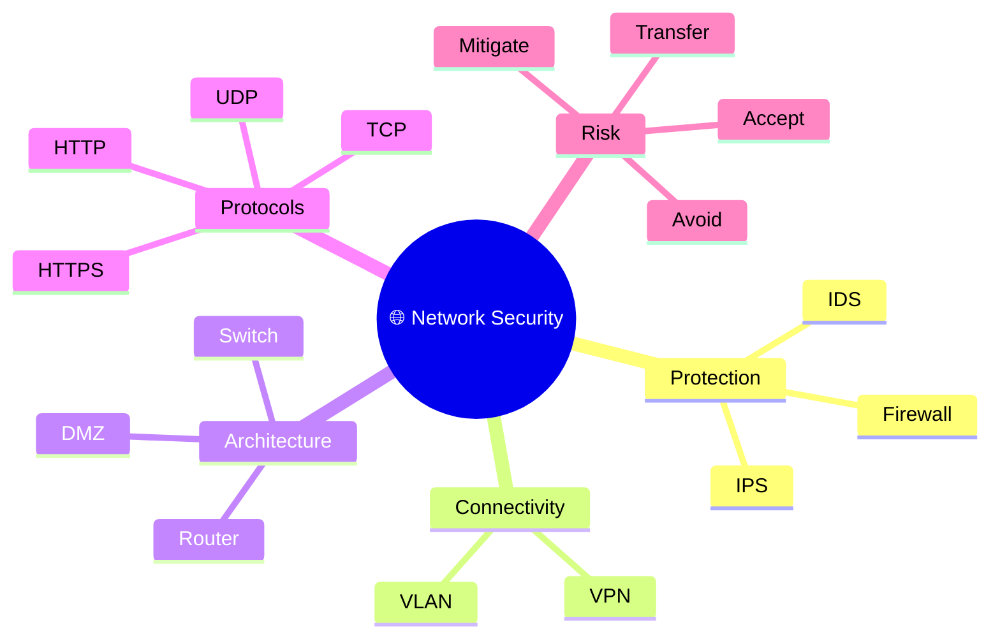
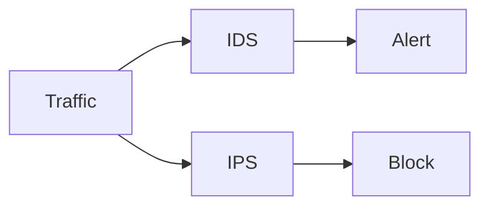
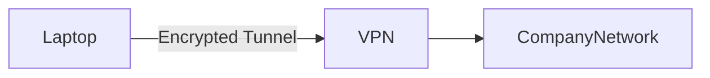
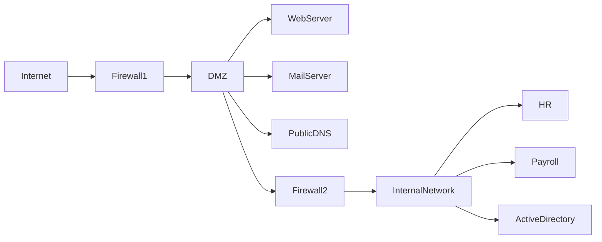
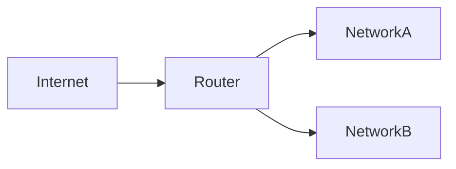
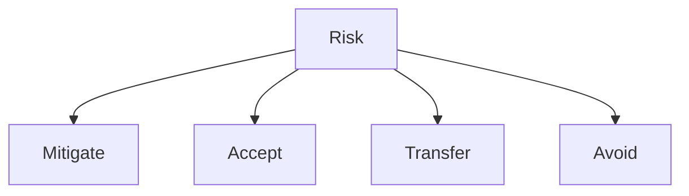

# 🌐 Domain 4 – Network Security

> **Objective:** Protect data while it is transmitted across networks and ensure only authorized communication is allowed.

---

# 🧠 Domain Mind Map



---

# 📌 Domain Overview

Network Security protects systems, applications, and data while it travels across networks. It focuses on preventing unauthorized access, securing communications, and reducing the impact of attacks.

---

# 🔥 Firewall

A **Firewall** filters incoming and outgoing network traffic based on predefined security rules.

### Network Flow

```text
Internet
    │
    ▼
┌──────────┐
│ Firewall │
└──────────┘
    │
 ┌──┴─────┐
 │        │
Allow    Block
 │        │
443      23
HTTPS    Telnet
```

Think of it as a **security guard** deciding who is allowed into a building.

### Key Points

- Filters network traffic
- Allows legitimate traffic
- Blocks unauthorized traffic

---

# 👁 IDS vs 🛡 IPS

Both monitor network traffic, but respond differently.



| Feature | IDS | IPS |
|---------|-----|-----|
| Full Form | Intrusion Detection System | Intrusion Prevention System |
| Detect Attack | ✅ | ✅ |
| Generate Alert | ✅ | ✅ |
| Block Attack | ❌ | ✅ |
| Type | Passive | Active |

### Memory Trick

🧠 IDS = **See**

🧠 IPS = **Stop**

---

# 🔐 VPN (Virtual Private Network)

A VPN creates an **encrypted tunnel** between a user and a private network over the Internet.



### Purpose

- Secure remote access
- Protect confidentiality
- Encrypt data over the Internet

Example:

An employee working from home securely connects to the corporate network.

---

# 🌍 VLAN (Virtual Local Area Network)

A VLAN logically separates devices into different networks while using the same physical switch.

```
              Switch
          ┌────┼────┐
          │    │    │
         HR Finance Guest
```

### Benefits

- Network Segmentation
- Improved Security
- Reduced Broadcast Traffic

---

# 🏰 DMZ (Demilitarized Zone)

A DMZ is an isolated network used to host public-facing services while protecting the internal network.



### Purpose

If a public server is compromised, attackers are **isolated from the internal network**, making lateral movement much harder.

### Usually placed in a DMZ

- 🌐 Web Server
- 📧 Mail Server
- 🌍 Public DNS
- 🔄 Reverse Proxy

### Never placed in a DMZ

- HR Database
- Payroll System
- Active Directory
- Employee Devices

---

# 🤝 TCP vs 🚀 UDP

| Feature | TCP | UDP |
|---------|------|------|
| Reliable | ✅ | ❌ |
| Connection-Oriented | ✅ | ❌ |
| Guarantees Delivery | ✅ | ❌ |
| Faster | ❌ | ✅ |

### Examples

| TCP | UDP |
|------|------|
| HTTPS | DNS |
| SSH | VoIP |
| FTP | Video Streaming |

### Memory Trick

🤝 TCP = Reliable

🚀 UDP = Fast

---

# 🌐 HTTP vs HTTPS

| Feature | HTTP | HTTPS |
|---------|-------|---------|
| Port | 80 | 443 |
| Encryption | ❌ | ✅ |
| Uses TLS | ❌ | ✅ |

HTTPS protects **Confidentiality** and **Integrity** of web communication.

---

# 🌐 Router vs 🖥 Switch



A **Router** connects different networks.

---

```text
PC ─┐
PC ─┼── Switch
PC ─┘
```

A **Switch** connects devices within the same network.

| Router | Switch |
|---------|---------|
| Layer 3 | Layer 2 |
| Connects Networks | Connects Devices |
| Routes Packets | Forwards Frames |

---

# 🔌 Common Network Ports

| Port | Protocol | Purpose |
|------|----------|----------------------|
| 20/21 | FTP | File Transfer |
| 22 | SSH | Secure Remote Login |
| 23 | Telnet | Insecure Remote Login |
| 25 | SMTP | Email |
| 53 | DNS | Name Resolution |
| 80 | HTTP | Web |
| 110 | POP3 | Email Retrieval |
| 143 | IMAP | Email Retrieval |
| 443 | HTTPS | Secure Web |
| 445 | SMB | Windows File Sharing |
| 3389 | RDP | Remote Desktop |

---

# ⚠ Risk Treatment



| Treatment | Meaning | Example |
|-----------|---------|---------|
| Mitigate | Reduce the risk | Apply patches |
| Accept | Live with the risk | Server retiring next week |
| Transfer | Shift financial risk | Cyber Insurance |
| Avoid | Eliminate the activity | Shut down the vulnerable service |

---

# 🌍 Real-World Scenario

A company hosts its public website.

```
Internet
      │
Firewall
      │
DMZ
      │
Web Server
      │
Firewall
      │
Internal Network
      │
HR • Payroll • Active Directory
```

If the web server is compromised, the attacker reaches the **DMZ**, not the internal network.

---

# 💡 Exam Tips

> ✅ IDS = Detect

> ✅ IPS = Prevent

> ✅ VPN = Encrypted Tunnel

> ✅ VLAN = Segmentation

> ✅ DMZ = Public-Facing Servers

> ✅ TCP = Reliable

> ✅ UDP = Fast

> ✅ HTTP = Port 80

> ✅ HTTPS = Port 443

> ✅ SSH is preferred over Telnet

---

# ⚠ Common Exam Mistakes

- Don't confuse **IDS** with **IPS**.
- A **DMZ does not prevent attacks**; it **limits the impact**.
- **VPN provides confidentiality**, not authentication by itself.
- **TCP is reliable**, **UDP is faster**.
- **Risk Mitigation ≠ Risk Avoidance**.

---

# 📝 Key Takeaways

- Firewalls filter network traffic.
- IDS detects attacks; IPS detects and blocks them.
- VPN creates encrypted tunnels for secure remote access.
- VLANs logically segment networks.
- DMZ isolates public-facing services from internal systems.
- Routers connect networks; switches connect devices.
- HTTPS encrypts web traffic.
- Understand common ports and risk treatment methods for the ISC2 CC exam.
