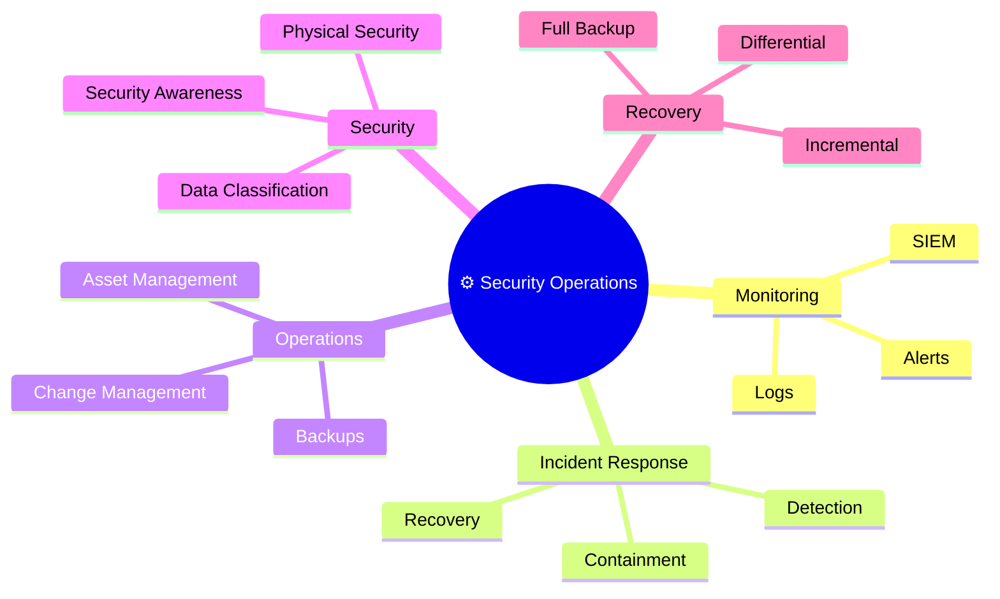
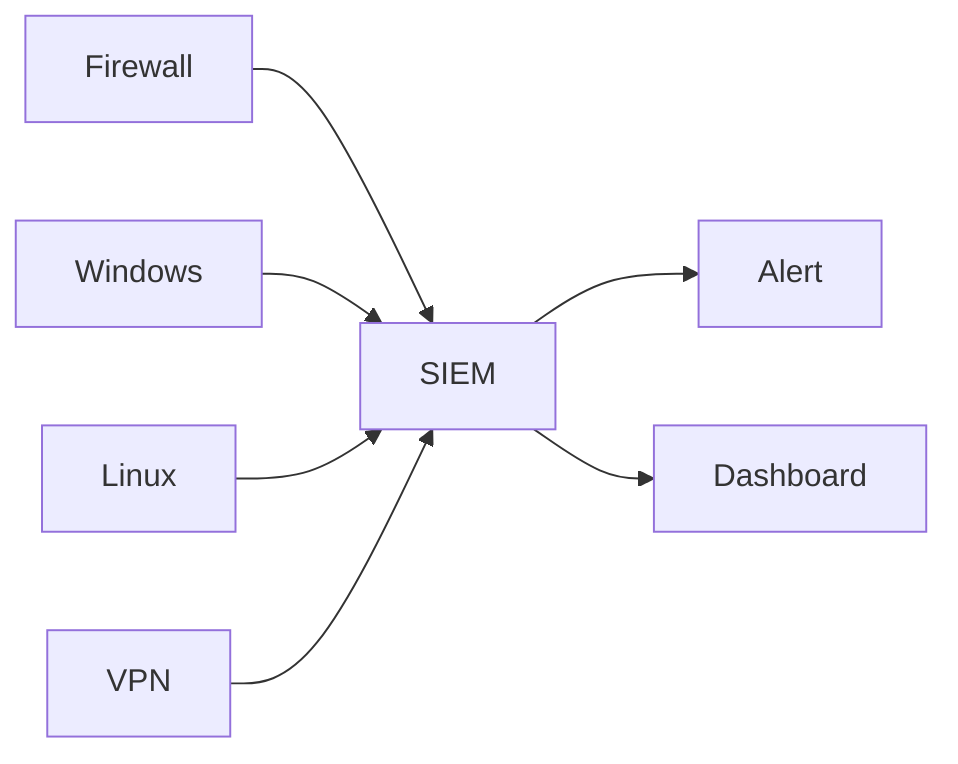
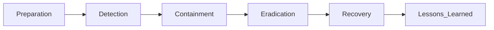

# ⚙️ Domain 5 – Security Operations

> **Objective:** Ensure the secure day-to-day operation of an organization's information systems through monitoring, incident handling, asset management, change management, and security best practices.

---

# 🧠 Domain Mind Map



---

# 📌 Domain Overview

Security Operations focuses on the daily activities required to protect an organization's systems, users, and data. It includes monitoring security events, managing assets, responding to incidents, maintaining backups, and ensuring security controls remain effective.

---

# 📜 Logging

Logs record events that occur on systems and devices.

Examples include:

- User logins
- Failed authentication attempts
- File access
- Firewall events
- System changes

### Purpose

- Record security events
- Support investigations
- Detect suspicious activity

---

# 👀 Monitoring & SIEM

Monitoring means continuously reviewing logs and system activity for abnormal behavior.

A **SIEM (Security Information and Event Management)** collects logs from multiple sources and correlates them into meaningful alerts.



### Benefits

- Centralized logging
- Faster detection
- Incident investigation
- Compliance reporting

---

# 💾 Backup Types

Backups primarily support **Availability**.

| Backup Type | Description |
|-------------|-------------|
| Full | Copies all data |
| Incremental | Copies changes since the previous backup |
| Differential | Copies changes since the last Full backup |

### Memory Trick

```text
Full
 ↓
Inc
 ↓
Inc
 ↓
Inc
```

Incremental → Since last backup

Differential → Since last Full backup

---

# 📦 Asset Management

You cannot secure assets you don't know exist.

Examples of assets:

- Servers
- Laptops
- Firewalls
- Switches
- Databases
- Cloud resources

### Purpose

- Maintain inventory
- Track ownership
- Support patching
- Reduce unknown devices

---

# 🔄 Change Management

Changes should follow a controlled process to reduce business risk.


### Benefits

- Reduces outages
- Prevents unauthorized changes
- Improves accountability

---

# 🏷️ Data Classification

Data should receive protection appropriate to its sensitivity.

| Classification | Example |
|----------------|---------|
| Public | Company website |
| Internal | Employee handbook |
| Confidential | Customer records |
| Restricted | Payroll, Encryption Keys |

---

# 🏢 Physical Security

Examples include:

- CCTV
- Security Guards
- Locks
- Biometric Access
- Badge Readers
- Mantraps

> 💡 **Exam Tip:** A **Mantrap** helps prevent **tailgating**.

---

# 🎓 Security Awareness

Security is everyone's responsibility.

Training commonly covers:

- Phishing
- Password security
- Social engineering
- Safe browsing
- USB risks
- Reporting incidents

### Goal

Reduce human error.

---

# 🚨 Incident Response (Overview)



The objective is to minimize damage and restore normal operations quickly.

---

# 📊 Security Operations Summary

| Topic | Key Purpose |
|--------|-------------|
| Logs | Record events |
| Monitoring | Watch for suspicious activity |
| SIEM | Collect and correlate logs |
| Asset Management | Know what you own |
| Change Management | Reduce risk from changes |
| Backups | Restore data and ensure availability |
| Data Classification | Protect based on sensitivity |
| Security Awareness | Reduce human error |
| Physical Security | Protect facilities and people |

---

# 🌍 Real-World Scenario

A company notices thousands of failed login attempts overnight.

The SIEM collects authentication logs from multiple systems and generates an alert.

The security team investigates, blocks the attacker's IP address, and reviews account activity to ensure no compromise occurred.

---

# ⚠ Common Exam Mistakes

- Don't confuse **Logging** with **Monitoring**.
- SIEM **collects and correlates** logs—it is not a firewall.
- Backups primarily support **Availability**.
- Asset Management means **knowing what you own**.
- Security Awareness reduces **human error**, not hardware failures.
- Change Management is about reducing risk—not slowing the business.

---

# 💡 Exam Tips

> ✅ SIEM = Centralized log collection & correlation

> ✅ Logs record events

> ✅ Monitoring detects abnormal activity

> ✅ Backups support Availability

> ✅ Asset Management = Inventory

> ✅ Change Management reduces operational risk

> ✅ Security Awareness reduces human mistakes

> ✅ Mantrap prevents tailgating

---

# 📝 Key Takeaways

- Security Operations is the day-to-day protection of organizational systems.
- Logs provide evidence of events and support investigations.
- SIEM centralizes and analyzes security events.
- Backups ensure systems and data can be recovered.
- Asset and Change Management improve operational security.
- Physical Security and Security Awareness are essential parts of a defense-in-depth strategy.