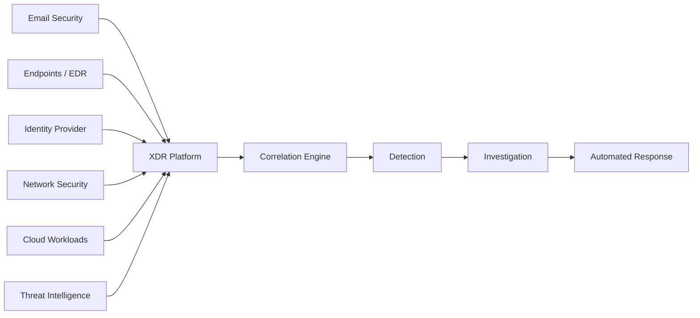

# What is XDR (Extended Detection and Response)?

## Overview

Extended Detection and Response (XDR) is a cybersecurity platform that combines telemetry from multiple security layers—including endpoints, email, identity, cloud workloads, servers, and network devices—to provide centralized threat detection, investigation, and response.

Unlike traditional EDR, which focuses only on endpoints, XDR correlates events across the entire IT environment, allowing security teams to detect sophisticated attacks that span multiple systems.

---

## Why is XDR Needed?

Modern cyberattacks rarely target a single system.

A typical attack may begin with a phishing email, compromise a user's identity, move laterally across endpoints, communicate with malicious servers, and eventually impact cloud resources.

Managing each security product separately makes it difficult to identify the complete attack chain.

XDR solves this problem by collecting and correlating telemetry from multiple security products into a single platform.

---

## XDR Architecture

---

## How XDR Works

### 1. Data Collection

XDR gathers telemetry from multiple security sources:

- Endpoint Detection & Response (EDR)
- Email Security
- Identity Providers
- Firewalls
- Network Security Tools
- Cloud Platforms
- Threat Intelligence Feeds

---

### 2. Correlation

Instead of treating every alert independently, XDR correlates related events.

For example:

- Suspicious email received
- User clicks the attachment
- PowerShell launches
- Endpoint contacts a malicious IP
- User signs in from an unusual location

Individually these events may appear harmless.

Together, they indicate an active cyberattack.

---

### 3. Investigation

Analysts receive a single incident containing:

- Timeline of events
- Impacted users
- Affected devices
- Network activity
- Identity information
- Cloud events

This dramatically reduces investigation time.

---

### 4. Response

Common response actions include:

- Isolating endpoints
- Disabling user accounts
- Blocking malicious IP addresses
- Quarantining emails
- Stopping malicious processes
- Triggering automated playbooks

---

## XDR vs EDR

| Feature | EDR | XDR |
|----------|-----|-----|
| Endpoint Visibility | ✅ | ✅ |
| Email Visibility | ❌ | ✅ |
| Identity Monitoring | ❌ | ✅ |
| Cloud Monitoring | ❌ | ✅ |
| Network Visibility | ❌ | ✅ |
| Threat Correlation | Limited | Advanced |
| Automated Response | Limited | Extensive |

---

## Real-World Example

An employee receives a phishing email containing a malicious attachment.

The attacker steals the user's Microsoft 365 credentials.

The attacker signs in from another country, accesses SharePoint files, executes PowerShell on the user's laptop, and attempts to move laterally to another server.

An EDR solution would primarily detect suspicious endpoint activity.

An XDR platform correlates the phishing email, identity compromise, endpoint activity, cloud access, and network events into a single incident, giving analysts complete visibility into the attack.

---

## Popular XDR Solutions

- CrowdStrike Falcon XDR
- Microsoft Defender XDR
- Palo Alto Cortex XDR
- SentinelOne Singularity XDR
- Trellix XDR
- Trend Vision One

---

## Key Takeaways

- XDR extends security beyond endpoints.
- It combines data from multiple security tools into one platform.
- Correlation reduces alert fatigue.
- Investigation becomes significantly faster.
- Automated response helps contain attacks quickly.

---

## Conclusion

XDR represents the next evolution of modern cybersecurity operations. By combining endpoint, identity, email, cloud, and network telemetry into a single platform, XDR enables organizations to detect complex attacks faster, reduce investigation time, and improve overall security posture.
