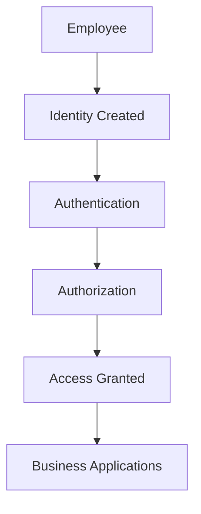
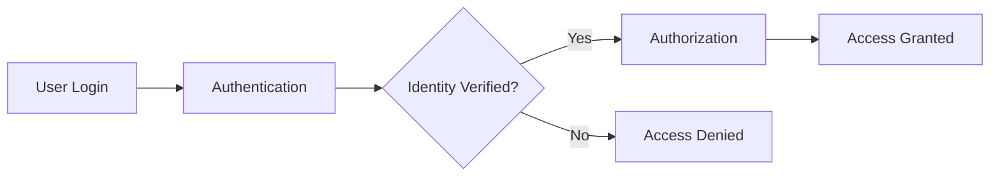
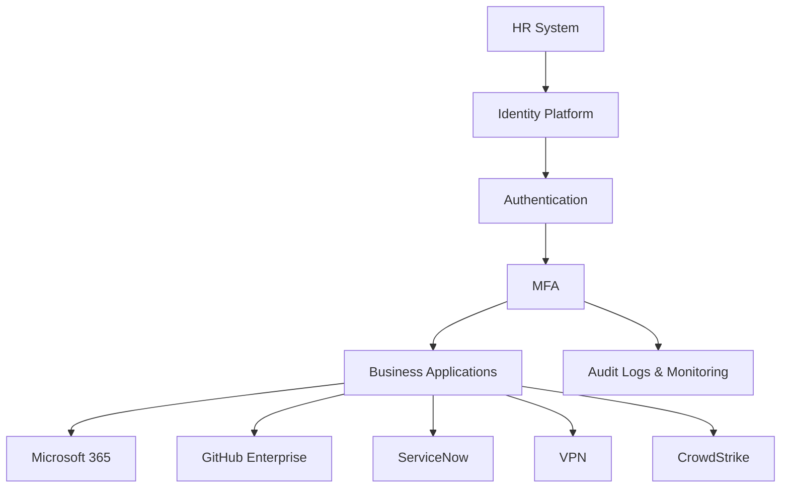

# 🛡️ Identity and Access Management (IAM)

---

# 🎯 Objective

Understand what **Identity and Access Management (IAM)** is, why it is considered the foundation of enterprise security, and how organizations securely manage user identities, authentication, and access to business resources.

By the end of this article, you will understand how IAM works in a modern enterprise and why it plays a critical role in protecting users, devices, applications, and sensitive business data.

---

# 🌍 Why IAM Matters

Imagine a global organization with thousands of employees spread across multiple countries.

Every day:

- New employees join the company.
- Existing employees change teams or receive promotions.
- Contractors require temporary access.
- Employees resign or are terminated.
- Thousands of users log into dozens of business applications.

Now imagine managing all of this manually.

Without a centralized Identity and Access Management (IAM) solution, organizations quickly lose visibility and control over who has access to what.

Poor identity management can lead to:

- Unauthorized access to sensitive data
- Former employees retaining access to company systems
- Excessive permissions granted to users
- Difficulty meeting compliance requirements
- Increased risk of security breaches

Modern organizations rely on IAM to ensure that the **right people have the right access to the right resources at the right time.**

---

# 📖 What is Identity and Access Management?

Identity and Access Management (IAM) is a framework of policies, technologies, and processes used to manage digital identities and control access to organizational resources.

IAM answers two fundamental questions:

## 👤 Who are you?

This is known as **Identity**.

An identity can represent:

- An employee
- A contractor
- A customer
- A service account
- A device
- A virtual machine
- An application

Anything that needs to authenticate within an environment has an identity.

---

## 🔑 What are you allowed to access?

This is known as **Access Management**.

Once an identity has been verified, IAM determines:

- Which applications the user can access
- What actions they are allowed to perform
- Which resources should remain restricted

For example:

| User | Allowed Access |
|-------|----------------|
| Security Analyst | CrowdStrike, ServiceNow, Microsoft 365 |
| HR Manager | HR Portal, Payroll System |
| Software Developer | GitHub Enterprise, Jira |
| Finance Manager | ERP System, Financial Reports |

Identity verifies **who you are**.

Access Management determines **what you can do**.

---

# 🔄 How IAM Works

### Step 1 – Identity Creation

Every employee is assigned a unique digital identity.

This identity typically includes:

- Username
- Email address
- Employee ID
- Department
- Job Role
- Manager
- Location

---

### Step 2 – Authentication

The user attempts to sign in.

The IAM platform verifies the user's identity using one or more authentication methods such as:

- Username & Password
- Multi-Factor Authentication (MFA)
- Biometrics
- Security Keys

---

### Step 3 – Authorization

After successful authentication, IAM determines what the user is permitted to access.

This decision is usually based on:

- User role
- Department
- Security groups
- Policies
- Device compliance

---

### Step 4 – Access Granted

The user is granted access only to the applications and resources required for their job.

This follows the **Principle of Least Privilege**, where users receive only the minimum permissions necessary to perform their responsibilities.

---

# 🧩 Core Components of IAM

| Component | Description |
|-----------|-------------|
| **Identity** | A digital representation of a user, device, application, or service. |
| **Authentication** | Verifies that the identity is genuine. |
| **Authorization** | Determines what the identity is allowed to access. |
| **Roles** | Define a user's responsibilities within the organization. |
| **Groups** | Simplify permission management by assigning users to groups instead of individually. |
| **Policies** | Security rules that control authentication and access decisions. |
| **Provisioning** | Automatically creates user accounts and assigns access. |
| **De-provisioning** | Removes or disables accounts when access is no longer required. |

---

# 👤 Identity Lifecycle

Every identity follows a lifecycle throughout its employment.

Managing this lifecycle is one of the primary responsibilities of an IAM solution.

## 🟢 Joiner

A new employee joins the organization.

The IAM platform:

- Creates the user account
- Assigns an email address
- Places the user into appropriate groups
- Assigns application access
- Applies required security policies

The employee is productive on Day One without requiring manual intervention.

---

## 🟡 Mover

Employees frequently change departments, receive promotions, or take on new responsibilities.

Rather than creating new accounts, IAM updates existing permissions.

For example:

**Before Promotion**

- Service Desk Portal
- Basic VPN Access

**After Promotion**

- Azure Portal
- GitHub Enterprise
- CrowdStrike Console
- Administrative VPN Access

Access is updated while maintaining the same identity.

---

## 🔴 Leaver

When an employee leaves the organization, IAM immediately removes access.

Typical actions include:

- Disable user account
- Revoke VPN access
- Disable email
- Remove application access
- Invalidate active sessions
- Archive data according to company policy

Failing to properly de-provision users is one of the most common causes of unauthorized access within organizations.

---

# 💡 Real-World Example

Imagine a company with **5,000 employees** across multiple countries.

Every month:

- 80 new employees join.
- 25 employees change departments.
- 15 employees leave the organization.

Without IAM, the IT team would manually:

- Create user accounts
- Configure email
- Assign application permissions
- Remove old permissions
- Disable accounts after resignation

This process would be slow, error-prone, and difficult to manage.

With IAM, these tasks become automated, ensuring users receive the correct access quickly while reducing administrative overhead and improving security.

---

# ✅ Key Takeaways

- Identity and Access Management (IAM) is the foundation of enterprise security.
- IAM manages digital identities and controls access to organizational resources.
- Identity answers **"Who are you?"**
- Access Management answers **"What are you allowed to do?"**
- Authentication verifies identity, while authorization determines permissions.
- IAM automates the entire identity lifecycle, from onboarding to offboarding.
- Modern organizations rely on IAM to improve security, simplify administration, and support compliance requirements.
---

# 🔐 Authentication vs Authorization

Authentication and Authorization are often confused, but they serve two completely different purposes within an IAM solution.

Authentication answers the question:

> **Who are you?**

Authorization answers the question:

> **What are you allowed to do?**

Authentication always occurs **before** authorization.

### Comparison

| Authentication | Authorization |
|----------------|---------------|
| Verifies identity | Determines permissions |
| Happens first | Happens after authentication |
| Username, Password, MFA | Roles, Groups, Policies |
| "Who are you?" | "What can you do?" |

### Real-World Analogy

Imagine arriving at an airport.

**Authentication**

The immigration officer checks your passport to verify who you are.

**Authorization**

After verification, your boarding pass determines which flight you can board and whether you have access to the Business Lounge.

The passport proves your identity.

The boarding pass determines your level of access.

---

# 🏢 Where IAM Fits in an Enterprise

Identity is no longer limited to logging into a Windows computer.

Modern organizations use IAM to provide secure access to hundreds of applications and cloud services.

The Identity Platform becomes the central point of trust for the entire organization.

Every authentication request, access decision, and security policy passes through this platform before users are allowed to access company resources.

---

# 🛠 Common IAM Technologies

Modern IAM is made up of several technologies that work together to provide secure identity management.

| Technology | Purpose |
|------------|----------|
| **Active Directory** | Traditional on-premises directory service used for Windows authentication and domain management. |
| **Microsoft Entra ID** | Cloud identity platform providing authentication, Single Sign-On, Conditional Access, and MFA. |
| **Okta** | Enterprise Identity Provider (IdP) that offers SSO, MFA, and identity federation across cloud applications. |
| **Single Sign-On (SSO)** | Allows users to authenticate once and securely access multiple applications. |
| **Multi-Factor Authentication (MFA)** | Adds an additional verification step beyond passwords to strengthen security. |
| **Role-Based Access Control (RBAC)** | Grants permissions based on job roles instead of assigning permissions individually. |
| **Conditional Access** | Evaluates risk before granting access using conditions such as location, device compliance, and user risk. |
| **Privileged Access Management (PAM)** | Protects administrative and highly privileged accounts from misuse or compromise. |
| **Identity Governance** | Ensures users maintain the correct level of access throughout their employment lifecycle. |

> Each of these technologies will be covered in dedicated articles throughout this learning journal.

---

# 🎯 Benefits of IAM

| Benefit | Description |
|----------|-------------|
| Improved Security | Reduces unauthorized access through strong authentication and centralized identity management. |
| Simplified Administration | Automates user onboarding, role changes, and account de-provisioning. |
| Better User Experience | Enables Single Sign-On, reducing the number of passwords users must remember. |
| Compliance | Helps organizations meet regulatory requirements through auditing and access reviews. |
| Reduced Risk | Enforces least privilege and minimizes excessive permissions. |
| Operational Efficiency | Reduces manual administrative tasks and improves consistency across the enterprise. |

---

# 🚀 What's Next?

Identity and Access Management is much more than creating user accounts.

Modern enterprises build their security strategy around identity by implementing technologies such as:

- Single Sign-On (SSO)
- Multi-Factor Authentication (MFA)
- Role-Based Access Control (RBAC)
- Conditional Access
- Privileged Access Management (PAM)
- Identity Governance

Together, these technologies create a secure, scalable, and centralized identity platform capable of supporting thousands of users and applications.

In the next article, we'll explore **Single Sign-On (SSO)** and see how users can securely access multiple business applications with a single authentication.

---

# 💡 Final Thoughts

Identity is often referred to as the **new security perimeter**.

As organizations adopt cloud services, remote work, and Software-as-a-Service (SaaS) applications, protecting identities becomes just as important as protecting networks and endpoints.

A well-designed IAM solution not only strengthens security but also improves user experience, reduces administrative overhead, and enables organizations to scale securely.

---

# 📌 Key Takeaways

- IAM is the foundation of modern enterprise security.
- Every user, device, application, and service has a digital identity.
- Authentication verifies identity, while authorization determines permissions.
- IAM automates the complete identity lifecycle from onboarding to offboarding.
- Technologies such as Active Directory, Microsoft Entra ID, Okta, MFA, and SSO work together to deliver secure identity management.
- Identity has become one of the most important security layers in modern organizations.