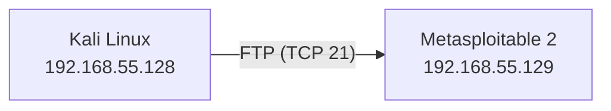
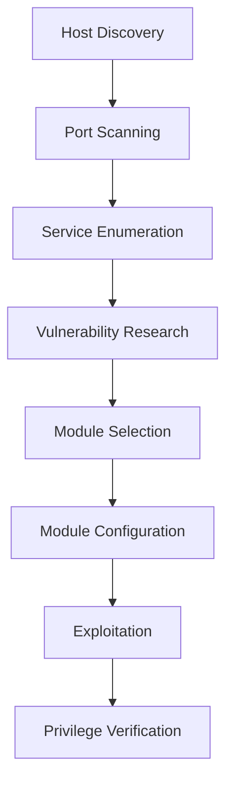
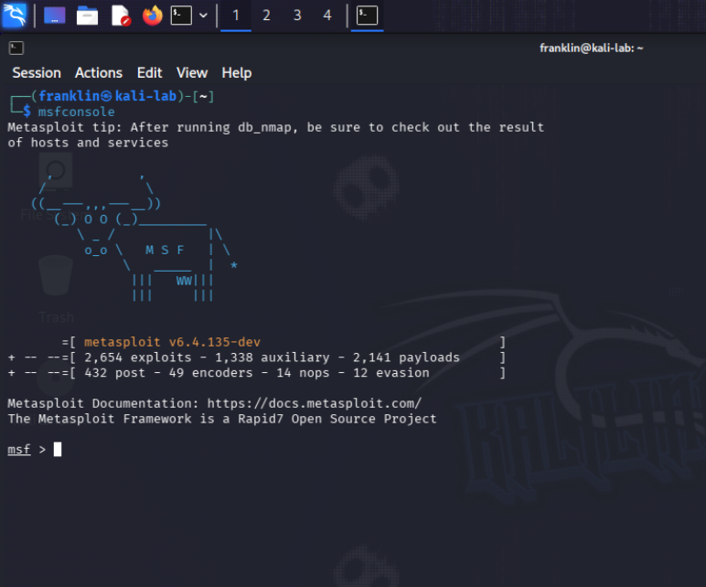
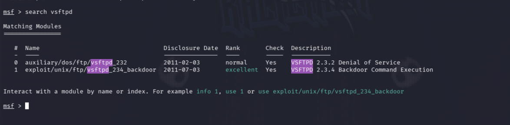
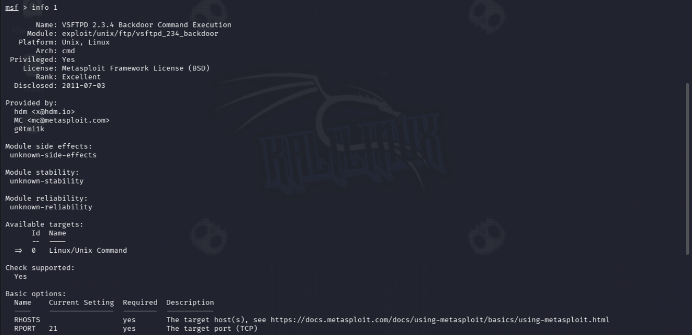
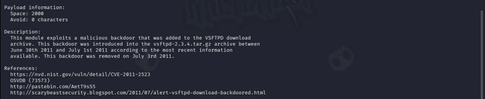
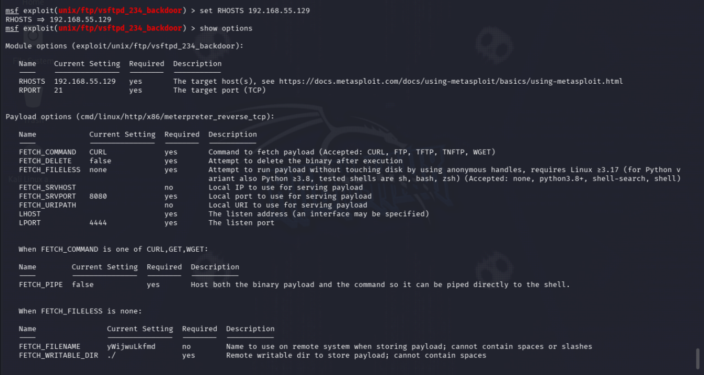
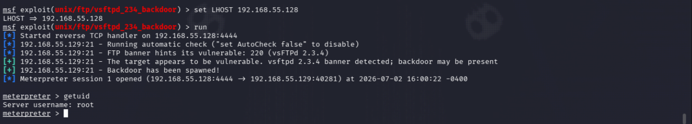

# Exploiting vsftpd 2.3.4 using Metasploit

## Objective

The objective of this lab was to identify, validate, and exploit a known vulnerability in the vulnerable FTP service running on Metasploitable 2.

The exercise focuses on understanding the complete penetration testing methodology rather than simply executing an exploit.

Topics covered include:

- Service Enumeration
- Vulnerability Research
- CVE Identification
- Exploit Validation
- Metasploit Module Selection
- Successful Exploitation
- Post-Exploitation Verification

## Lab Environment

| Component | Details |
|-----------|---------|
| Host OS | Windows 11 |
| Hypervisor | VMware Workstation |
| Attacker Machine | Kali Linux |
| Target Machine | Metasploitable 2 |
| Network | Host-only (VMnet1) |

## Network Topology

## Methodology

## Step 1 - Launching Metasploit

The Metasploit Framework was launched from Kali Linux to perform controlled exploitation against the vulnerable target.

Rather than immediately executing an exploit, the framework was used to research and validate the appropriate exploit module.

## Step 2 - Searching for the Appropriate Exploit Module

After identifying the FTP service as **vsftpd 2.3.4**, the next step was to determine whether Metasploit contained a module capable of exploiting the discovered vulnerability.

Rather than executing an exploit blindly, the search functionality within Metasploit was used to identify modules related to the detected software version.

This step reinforces an important penetration testing principle: exploitation should always be based on validated evidence obtained during reconnaissance and vulnerability research.

## Step 3 - Reviewing Module Information

Before attempting exploitation, the selected Metasploit module was examined using the `info` command.

Reviewing the module information provides valuable details including:

- Vulnerability description
- Associated CVE references
- External references such as Exploit-DB
- Supported targets
- Required configuration options
- Compatible payloads

Inspecting a module before execution is considered a best practice, as it helps validate that the correct exploit is being used against the intended target.

## Step 4 - Configuring the Exploit

Before executing the exploit, the required module parameters were configured.

The primary options included:

- **RHOSTS** – Specifies the IP address of the target system.
- **RPORT** – Specifies the target service port (default FTP port 21).
- **LHOST** – Specifies the attacker's IP address, allowing the reverse payload to establish a connection back to the attacking machine.

Understanding these parameters is essential, as incorrect configuration can prevent exploitation even when the target is vulnerable.

After configuring the required options, the module was ready for execution.

## Step 5 - Successful Exploitation

The Metasploit module successfully exploited the vulnerable **vsftpd 2.3.4** service and established a Meterpreter session with the target.

Following successful exploitation, the `getuid` command confirmed that the session was running with **root privileges**, demonstrating complete compromise of the vulnerable system.

This phase illustrates the impact of leaving publicly known vulnerabilities unpatched, as remote attackers can gain full administrative access without valid credentials.

## Lessons Learned

This lab demonstrated that successful penetration testing is built upon a structured methodology rather than simply executing exploits.

Throughout this exercise, I learned to:

- Perform service enumeration using Nmap.
- Identify vulnerable software versions.
- Research publicly disclosed vulnerabilities (CVEs).
- Understand CVSS severity ratings.
- Differentiate between CVEs, Proof of Concepts (PoCs), Exploit-DB entries, and Metasploit modules.
- Configure Metasploit modules correctly.
- Establish a Meterpreter session.
- Verify privilege levels following successful exploitation.

Perhaps the most valuable takeaway was understanding that exploitation is only one phase of the penetration testing lifecycle. Proper reconnaissance, validation, and vulnerability research are equally important in achieving successful and reliable results.

## Defensive Perspective

The vulnerable version of **vsftpd 2.3.4** demonstrates how publicly known vulnerabilities can lead to complete system compromise when left unpatched.

Organizations can reduce this risk by:

- Maintaining an effective vulnerability management program.
- Regularly applying vendor security updates.
- Removing unsupported software versions.
- Restricting unnecessary exposure of FTP services.
- Monitoring for unusual outbound connections and indicators of compromise.
- Performing regular vulnerability assessments to identify outdated software before attackers do.

This lab reinforces the importance of proactive patch management as a critical component of enterprise security.

