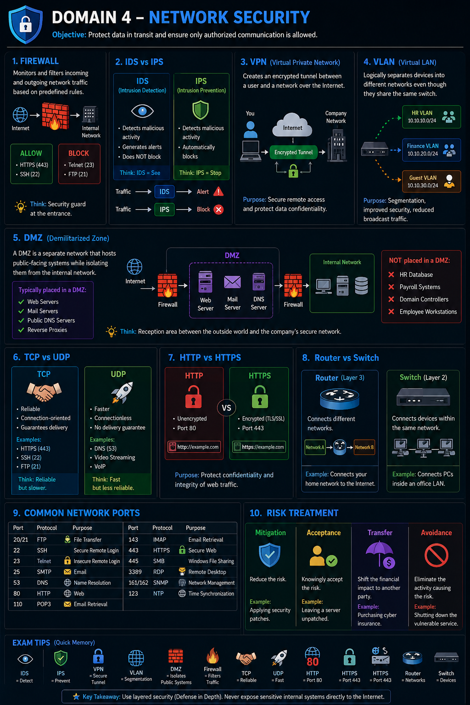

# 🌐 Domain 4 – Network Security

<p align="center">
  
</p>

> **Objective:** Protect data while it is transmitted across networks and ensure only authorized communication is allowed.

---

## 📌 Domain Overview

Network Security focuses on protecting systems, applications, and data from unauthorized access while ensuring secure communication between devices.

---

# 🔥 Firewall

A **Firewall** monitors and filters incoming and outgoing network traffic based on predefined security rules.

### Architecture

```text
Internet
    │
    ▼
┌──────────┐
│ Firewall │
└──────────┘
    │
 ┌──┴─────┐
 │         │
Allow    Block
 │         │
443      23
HTTPS    Telnet
```

Think of a firewall as a **security guard** deciding who is allowed to enter a building.

| Allows      | Blocks               |
| ----------- | -------------------- |
| HTTPS (443) | Telnet (23)          |
| SSH (22)    | Unauthorized Traffic |

💡 **Exam Tip:** Firewalls **filter traffic**. They do **not** detect malware already inside the network.

---

# 👁 IDS vs 🛡 IPS

Both monitor network traffic, but they respond differently.

```text
                Network Traffic
                      │
         ┌────────────┴────────────┐
         │                         │
       IDS                       IPS
         │                         │
    Detect & Alert          Detect & Block
```

| IDS                        | IPS                         |
| -------------------------- | --------------------------- |
| Intrusion Detection System | Intrusion Prevention System |
| Detects attacks            | Detects attacks             |
| Generates Alerts           | Blocks malicious traffic    |
| Passive                    | Active                      |

### Memory Trick

✅ IDS = **See**

✅ IPS = **Stop**

---

# 🔐 VPN (Virtual Private Network)

A VPN creates an **encrypted tunnel** between a user and a private network over the Internet.

```text
Laptop
   │
═══════════════════════
  Encrypted Tunnel
═══════════════════════
   │
Company Network
```

### Purpose

* Secure remote access
* Protect confidentiality
* Encrypt Internet traffic

Real-world example:

Employees working from home connect securely to their office network using a VPN.

---

# 🌍 VLAN (Virtual Local Area Network)

A VLAN logically separates devices into different networks while using the same physical switch.

```text
          Switch
        /    |     \
      HR   Finance Guest
```

### Purpose

* Network Segmentation
* Better Security
* Reduced Broadcast Traffic

Example:

| VLAN    | Department |
| ------- | ---------- |
| VLAN 10 | HR         |
| VLAN 20 | Finance    |
| VLAN 30 | Guest      |

---

# 🛡 DMZ (Demilitarized Zone)

A DMZ is an isolated network that hosts **public-facing servers**, preventing direct access to the internal network.

```text
                 Internet
                     │
             ┌────────────┐
             │ Firewall 1 │
             └────────────┘
                     │
      ┌────────────────────────────┐
      │            DMZ             │
      │                            │
      │ Web │ Mail │ DNS │ Server  │
      └────────────────────────────┘
                     │
             ┌────────────┐
             │ Firewall 2 │
             └────────────┘
                     │
      HR │ Payroll │ Domain Controller │ Users
```

### Why use a DMZ?

Even if the web server is compromised, attackers **cannot directly access** the internal network.

### Usually placed inside a DMZ

✅ Web Server

✅ Mail Server

✅ Public DNS

✅ Reverse Proxy

### Never placed inside a DMZ

❌ HR Database

❌ Payroll

❌ Active Directory

❌ Employee Workstations

💡 **Exam Tip**

The primary purpose of a DMZ is **to isolate public-facing systems from internal systems.**

---

# 🤝 TCP vs 🚀 UDP

| TCP                 | UDP                   |
| ------------------- | --------------------- |
| Reliable            | Faster                |
| Connection-Oriented | Connectionless        |
| Guarantees Delivery | No Delivery Guarantee |
| Slower              | Faster                |

### Examples

| TCP   | UDP             |
| ----- | --------------- |
| HTTPS | DNS             |
| SSH   | VoIP            |
| FTP   | Video Streaming |

### Memory Trick

🤝 TCP = Reliable

🚀 UDP = Fast

---

# 🌐 HTTP vs HTTPS

| HTTP        | HTTPS        |
| ----------- | ------------ |
| Port 80     | Port 443     |
| Unencrypted | Encrypted    |
| Less Secure | Uses TLS/SSL |

HTTPS protects both **Confidentiality** and **Integrity** of web communication.

---

# 🌐 Router vs 🖥 Switch

```text
Internet
    │
 Router
  /    \
LAN A  LAN B
```

A **Router** connects **different networks**.

---

```text
PC ─┐
PC ─┼── Switch
PC ─┘
```

A **Switch** connects devices **within the same network**.

| Router            | Switch           |
| ----------------- | ---------------- |
| Layer 3           | Layer 2          |
| Connects Networks | Connects Devices |
| Routes Traffic    | Forwards Frames  |

---

# 🔌 Common Network Ports

| Port  | Protocol | Purpose               |
| ----- | -------- | --------------------- |
| 20/21 | FTP      | File Transfer         |
| 22    | SSH      | Secure Remote Login   |
| 23    | Telnet   | Insecure Remote Login |
| 25    | SMTP     | Email                 |
| 53    | DNS      | Name Resolution       |
| 80    | HTTP     | Web Traffic           |
| 110   | POP3     | Email Retrieval       |
| 143   | IMAP     | Email Retrieval       |
| 443   | HTTPS    | Secure Web            |
| 445   | SMB      | Windows File Sharing  |
| 3389  | RDP      | Remote Desktop        |

💡 **Remember:** SSH (22) is preferred over Telnet (23).

---

# ⚠ Risk Treatment

```text
                    Risk
                      │
 ┌─────────┬──────────┬──────────┬─────────┐
 │         │          │          │
Mitigate Accept   Transfer   Avoid
 │         │          │          │
Patch   Live with  Insurance  Stop Activity
```

| Method   | Meaning                  | Example                      |
| -------- | ------------------------ | ---------------------------- |
| Mitigate | Reduce Risk              | Apply Security Patch         |
| Accept   | Knowingly Live With Risk | Server retiring next week    |
| Transfer | Shift Financial Risk     | Cyber Insurance              |
| Avoid    | Eliminate Risk           | Shut down vulnerable service |

---

# 📝 Exam Tips

> 💡 IDS = Detect

> 💡 IPS = Prevent

> 💡 VPN = Secure Encrypted Tunnel

> 💡 VLAN = Network Segmentation

> 💡 DMZ = Public Servers

> 💡 TCP = Reliable

> 💡 UDP = Fast

> 💡 HTTPS = Port 443

> 💡 HTTP = Port 80

> 💡 SSH > Telnet

---

# 🌍 Real-World Example

Imagine a company website.

Visitors access the **Web Server** through the Internet.

The Web Server is placed in the **DMZ**, while sensitive systems like **Payroll**, **HR**, and **Active Directory** remain inside the Internal Network behind another firewall.

If the Web Server is compromised, attackers are isolated in the DMZ and must bypass additional security controls before reaching critical business systems.

---

# 🎯 Key Takeaways

* Firewalls filter network traffic.
* IDS detects attacks; IPS detects and blocks them.
* VPNs create encrypted tunnels for remote access.
* VLANs logically separate networks.
* DMZs isolate public-facing servers.
* TCP is reliable; UDP is faster.
* HTTPS is encrypted; HTTP is not.
* Routers connect networks; switches connect devices.
* Understand common ports for the ISC2 CC exam.
* Know the four Risk Treatment methods: Mitigate, Accept, Transfer, Avoid.
